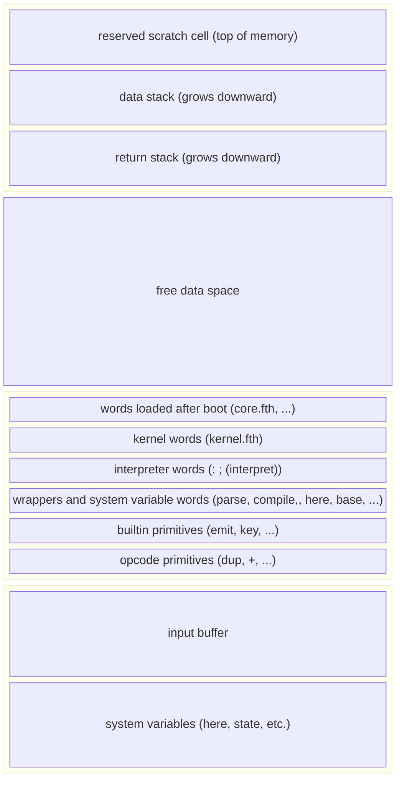

# Architecture

Most Forths implemented in systems languages like C, C++, or assembly use indirect-threaded code (ITC).
In ITC, colon definitions are a sequence of addresses pointing to native code routines.

In contrast, Ferth is written in safe Rust.
Safe Rust cannot cast an integer read from data space to a function pointer.
Therefore it is not possible to implement the classic indirect-threaded system in safe Rust.

Ferth uses **token threading** instead.
Compiled code consists of a sequence of bytecode instructions.
The VM interprets this sequence of instructions directly, mapping each **opcode** to the Rust primitive it represents.
(Refer to the [`body` field description](#body) for examples.)

## Data space

The data space in Ferth is a single shared slab.
System variables, the dictionary, and data stacks all share the same address space.



### System variables

System variables such as `state`, `here`, and `(latest)` occupy the lowest addresses in memory.
The input buffer sits between the system variables and the dictionary.

### Dictionary

The dictionary starts above the input buffer (`Layout::DATA`).
Like most Forths, the dictionary is a linked list that grows upwards.
Thus, when the system starts, words defined early in the boot sequence occupy the lowest dictionary addresses, and words defined last occupy the highest.

### Free data space

The free data space region sits between the top of the dictionary (`here`) and the stacks.

### Stacks

The stacks grow from the top downwards.
The top cell in memory is reserved as a scratch cell for the data stack.
(This is necessary because the top of stack value is stored in a register.)

## Components

### VM

The VM executes compiled instructions.
It holds state in a number of registers:

* `IP`, the instruction pointer. Points to the next instruction to execute.
* `SP`, the data stack pointer. The next push spills the cached `TOS` into the cell above `SP`.
* `RP`, the return stack pointer. Points to the next free cell in the return stack.
* `TOS`, the top of stack register. Holds the value at the top of the data stack.

Both stacks grow downward in memory.

The VM owns the main loop (`Vm::run`).
The kernel enters this loop through `Vm::enter`.
The VM executes instructions until it reaches a stop condition.
This is either a `Halt` (stop execution) or `Yield`.

#### Yielding

The VM implements most instructions itself, but it does not have direct access to the host system.
When the VM needs host system facilities such as I/O or the system clock, it yields execution to the host by returning a **yield token**.

The yield token contains the index of the builtin (Rust primitive) to execute, such as `emit` or `key`, in the kernel's builtins table.
It also privately wraps the current value of `IP`.

When the host finishes executing the primitive, it must resume execution by returning the **same yield token** to the VM through `Vm::resume`.
The Rust `YieldToken` type does not implement `Copy` or `Clone`, so the host must return the very token it received.
This prevents the host from tampering with `IP`.

#### `unsafe` and unchecked stack access

The data access layer always checks that addresses are valid: within range and aligned, if appropriate.
Because the VM stores its stacks in the data space, stack operations also use the data access layer.

In most cases, these checks are redundant for stack operations because the code has already verified the stack addresses are valid (e.g., will not overflow the stack).
The `unsafe` crate feature enables unchecked memory access for stack operations.
When enabled, the VM skips the redundant check and directly casts bytes from memory to `usize` stack values.

### Kernel

The kernel connects the VM, a plain execution engine, to the outside world.
It holds all the major system components together:

* VM
* system memory
* host facilities implementation
* Rust primitives that require host facilities (e.g. I/O words)

When the kernel is constructed, it enters a multi-phase boot sequence to bootstrap the Forth interpreter:

1. Reserve space for system variables (`state`, `here`, etc.).
2. Compile opcode primitives.
3. Register builtin primitives.
4. Compile environment queries (the values behind `environment?`).
5. Define system variables.
6. Compile wrappers around parsing and compiling opcodes (`parse`, `compile,`).
7. Compile the compiler and interpreter (`:`, `;`, and `(interpret)`).

After it has bootstrapped the interpreter, it compiles the rest of the system kernel in Forth ([`kernel.fth`](../src/kernel.fth)). This includes exception handling (`catch` and `throw`) and fundamental words. The `quit` and `(load)` entry points arrive later, when the system loads the core wordlist.

### System

The outermost layer, `Ferth`, holds the kernel and provides limited access to it with an embedding API. (Refer to the crate documentation for details.)

When the system starts, it:

1. Compiles the `core` wordlist and some helpful words from other lists.
2. Runs `(check-bootstrap)` to verify that every temporary bootstrap definition has been redefined.

After that, the user can execute one of three entry points:

|Rust|Forth|Description|
|---|---|---|
|`Fe::quit`|[`quit`](https://forth-standard.org/standard/core/QUIT)|Start the interactive interpreter.|
|`Fe::evaluate`|&mdash;|Evaluate a string of Forth code.|
|`Fe::load`|`(load)`|Read Forth code from the current input source.|

Note that `Fe::evaluate` does not exactly map to the standard word [`evaluate`](https://forth-standard.org/standard/core/EVALUATE) because `Fe::evaluate` evaluates the source line-by-line.

## Compilation

### Instructions

Ferth compiles programs to a sequence of **packed instructions** and literal data.
A packed instruction occupies a single cell in memory and includes the primitive's opcode, its XT, and possibly an operand.

Opcode primitives pack the opcode into the lowest byte and the XT into the higher bytes:

```
 0 1 2 3 4 5 6 7 8 9 a b c d e f 0 1 2 3 4 5 6 7 8 9 a b c d e f
+---------------+-----------------------------------------------+
|    opcode     |                     xt                        |
+---------------+-----------------------------------------------+
```

Builtin primitives reserve a byte for an optional byte operand.
`Yield` uses this field to encode the builtin index in the kernel's builtins table.

```
 0 1 2 3 4 5 6 7 8 9 a b c d e f 0 1 2 3 4 5 6 7 8 9 a b c d e f
+---------------+---------------+-------------------------------+
|    opcode     |    operand    |              xt               |
+---------------+---------------+-------------------------------+
```

This layout imposes some strict limits on words:

* The system can only support up to 256 opcodes and 256 builtins.
* With a 32-bit cell, opcode primitives may only occupy the lowest 2<sup>24</sup> (16&thinsp;777&thinsp;216) addresses in memory (2<sup>56</sup> with a 64-bit cell).
* With a 32-bit cell, builtin primitives may only occupy the lowest 2<sup>16</sup> (65&thinsp;536) addresses in memory (2<sup>48</sup> with a 64-bit cell).

The instruction encodes the target word's XT to facilitate decompiling word definitions ([`see`](https://forth-standard.org/standard/tools/SEE)).
Decompiling indirect-threaded Forth is simple: walk the word body, follow each XT, and fetch the word's name.
In this token-threaded Forth, we compile tokens (opcodes) for primitive words, not XTs.
Therefore we need some other means of fetching the word's name from its compiled form.
Packing the XT in the same instruction cell makes it easier to decompile words without maintaining a lookup table of opcode or builtin index to XT.

Some instructions read consecutive data from the instruction stream as literal data:

|Instruction|Arguments (cells)|
|---|---|
|`Lit`|1 (value)|
|Branching (`Call`, `Jmp`, `JmpZ`, etc.)|1 (address)|
|`Str`|variable (one length cell, followed by the string bytes)|
|`Yield`|0 (encodes builtin index as operand)|

### Words

With a 32-bit cell size, the word header looks like this in memory:

```text
 0 1 2 3 4 5 6 7 8 9 a b c d e f 0 1 2 3 4 5 6 7 8 9 a b c d e f
+---------------+---------------+-------------------------------+
|      pad...   |      len      |             name...           |
+---------------+---------------+-------------------------------+
|                              name...                          |
+---------------------------------------------------------------+
|                            bodylen                            |
+---------------+---------------+-------------------------------+
|  info (len)   | info (flags)  |        info (reserved)        |
+---------------+---------------+-------------------------------+
|                              link                             |
+---------------------------------------------------------------+
|                              code                             |
+---------------------------------------------------------------+
|                              body...                          |
+---------------------------------------------------------------+
```

#### `pad`

A variable-length field that ensures `bodylen` and the fields that follow align to cell addresses.

#### `name`

A counted string containing the name of the word.

The first byte is the length of the name; subsequent bytes are the bytes of the name.
The count byte allows names up to 255 bytes, but the system enforces a lower limit of 31 bytes (`MAX_WORD_LEN`).

Because of `pad`, `name` ends on a cell boundary.

#### `bodylen`

The length of the body in bytes.
Used by reflective code such as `see` to iterate over a word's definition (`body`).
`:` sets this to 0 when it begins a definition.
`;` calculates and sets `bodylen` when it ends the definition.

This is not a subfield of `info` because that would limit body length.
On 32-bit, `info` reserves 16 bits of space, so bodies would be limited to 2<sup>16</sup> bytes, as few as 8192 `Call` instructions.

#### `info`

`info` encodes key information about the word at a fixed offset from the XT (`code` field address).

The first byte encodes the length of the word name.
Similar to `bodylen`, this exists so that reflective code can easily extract a word's name without walking backwards from the `code` field.

The next byte encodes the word's flags.
At present, a word can have any combination of five flags:

* `IMMEDIATE`

    The word executes immediately in compilation state.
* `HIDDEN`

    `find` and similar words cannot find the word by name. Set by `:` and unset by `;`.
* `BOOTSTRAP`

    The word is a temporary definition. It must be redefined later in the bootstrap. When the system boots, `(check-bootstrap)` throws if any findable word still has this flag.
* `PRIMITIVE`

    The word is a native Rust routine, either an opcode or builtin.
* `COMPILE_ONLY`

    The word cannot execute in interpretation state.

`info` reserves the higher bytes at this time.

#### `link`

`link` contains the XT (`code` field address) of the previous word in the dictionary.

#### `code`

The `code` field contains an opcode instruction.

#### `body`

Primitive words (flagged `PRIMITIVE`) do not have bodies.
Their definitions do not end in an `Exit` instruction.
When the inner interpreter encounters a primitive word, it executes the opcode instruction in the `code` field and returns.

Consider the layout of the `dup` primitive.
The `Dup` instruction in the `code` cell encodes the `Dup` opcode as well as the word's XT, as described in [Instructions](#instructions).

```
         name      bodylen        code
         v         v              v
[pad...][3]["dup"][0][info][link][Dup]
```

In contrast, colon definitions contain a sequence of opcode instructions, terminated by an `Exit` instruction.
The inner interpreter simply starts executing instructions from the `code` field onwards until it encounters an `Exit` opcode.

Consider the layout of `over`:

```forth
: over >r dup r> swap ;
```

```
         name       bodylen         code
         v          v               v
[pad...][4]["over"][20][info][link][ToR][Dup][RFrom][Swap][Exit]
```

There is no `DOCOL` instruction to execute colon definitions.
Instead of following an address and *discovering* the target definition is a colon definition, the `Call` instruction immediately nests, jumps, and begins executing the target word from its `code` field.

Recall that each instruction cell packs the opcode and XT, so that `see` can easily decompile the word.

### Tail-call optimization

When a word ends in a `Call`, we can replace the `Call` with an unconditional `Jmp`.
This avoids the execution overhead of nesting.

Consider the definition of `2dup`:

```forth
: 2dup over over ;
```

The compiled version of this word looks like:

```
         name       bodylen         code
         v          v               v
[pad...][4]["2dup"][20][info][link][Call]['over][Call]['over][Exit]
```

Where `'over` is the XT of `over`.

With tail-call optimization, `Jmp` replaces the final `Call` to `over`:

```
         name       bodylen         code         patch
         v          v               v            v
[pad...][4]["2dup"][20][info][link][Call]['over][Jmp]['over][Exit]
```

Because this is safe for all words, the Forth kernel extends `;` to apply this to all definitions.

Note that this leaves an unreachable `Exit` at the end of the body.

## Errors

Errors can arise in any layer:

|Layer|Types of errors|Examples|
|---|---|---|
|VM|Arithmetic, memory access, stack|`InvalidOpCode`, `StackUnderflow`, `DivisionByZero`, `AddressOutOfRange`|
|Kernel|Invalid builtin, errors preventing the system from booting|`InvalidBuiltin`, `DataSpaceTooSmall`|
|Forth|Forth exceptions|`-13` undefined word, `-4` stack underflow, `-10` division by zero|

Notice that some errors overlap between the VM and Forth.
This means that the same error condition can happen in either layer.
We consider these errors **recoverable** and attempt to handle them gracefully.
Most VM errors are recoverable.

All of the Forth system's entry points (`quit`, `evaluate`, and `(load)`) catch thrown errors.
Before `throw` has been defined, all VM and kernel errors bubble up as Rust errors.
Once `throw` has been defined, the kernel re-enters the VM to throw recoverable errors as Forth exceptions instead, to be caught by the entry point.
Irrecoverable errors continue to bubble up.

Irrecoverable errors return to the embedding program as Rust errors.
These include invalid instructions (suggesting a corrupt dictionary) and errors that prevent the system from booting (such as the builtin table being full).
All kernel errors are irrecoverable.
Stack overflows (`StackOverflow`, `ReturnStackOverflow`) are also irrecoverable because `throw` uses the stacks.
